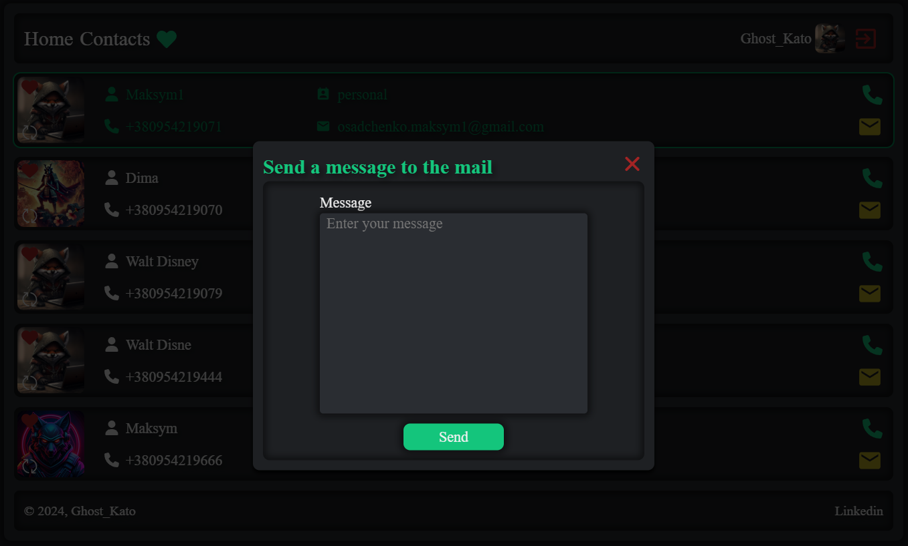

# Individual project: app phonebook

### Description:

The app phonebook is a digital tool for storing contact information, allowing you to organize phone numbers, email addresses and other important data about contacts. This project aims to create a convenient, intuitive application for quick access to information about important people in your life or business.

---

### Features:

1. **Interface:**

   - Simple and convenient design.
   - Search by name.
   - Ability to add new contacts with a minimum number of steps.
   - Display detailed information about each contact (name, phone number, email, photo).

   

2. **Contact Categories:**

   - Ability to add contacts to your favorite list, for quick access.

   

3. **Add photos:**

   - Each contact can be accompanied by a photo, which facilitates search and recognition.

   

4. **Editing and deleting:**

   - Easily edit or delete contact information as needed.

   

5. **Safety:**

   - Protection of personal data through encryption and access to the application by password.
   - The ability to change user data through a special form that allows you to edit the name, email and photo.

   

6. **Adaptive design:**

   - The application is optimized for various devices such as smartphones, tablets and desktops. Thanks to the adaptive design, users can comfortably use the application on any screen, while maintaining convenience and functionality.

7. **Authorization through Google:**

   - Users can log in to the app via Google, which facilitates the authorization and registration process. This saves time because you do not need to create a new account manually.

---

### Stages of implementation:

1. **Interface design:**

   - Developing interface layouts, choosing colors and fonts, creating a convenient menu and navigation.

   

2. **Development of functionality:**

   - Implement basic features such as adding, editing and deleting contacts, searching, and making calls and sending messages to mail.

   

3. **Testing:**

   - Conducting tests to ensure stable operation of the application on different devices.

   

4. **Launch and support:**

   - Publish the application and then update to improve functionality based on user feedback.

   

---

### Advantages of using:

- Easy access to information about important people and companies.
- Improve the organization of personal and work contacts.
- Save time searching for information.
- Ability to respond quickly thanks to a user-friendly interface.

---

### Technologies used:

1. **Programming languages:**
   - **JavaScript**

2. **Frameworks and Libraries:**
   - **React**
   - **React Router**  
   - **Redux**
   - 
3. **Databases:**
   - **MongoDB**

4. **API Integration:**
   - **SMTP**

5. **Safety:**
   - **OAuth 2.0**
   - **JWT**
   - **HTTPS**
     **bcrypt**

6. **Other technologies:**
   - **Git**
   - **Cloudinary**

7. **Adaptability:**
   - **CSS Media Queries**
   - **Flexbox**

---

The project involves the creation of a convenient and secure tool for storing contacts with the ability to add photos, edit and quickly access your favorite contacts. The application provides high security through encryption and authorization through Google, as well as adaptive design for various devices. The project includes the stages of developing the interface, functionality, testing and support.
