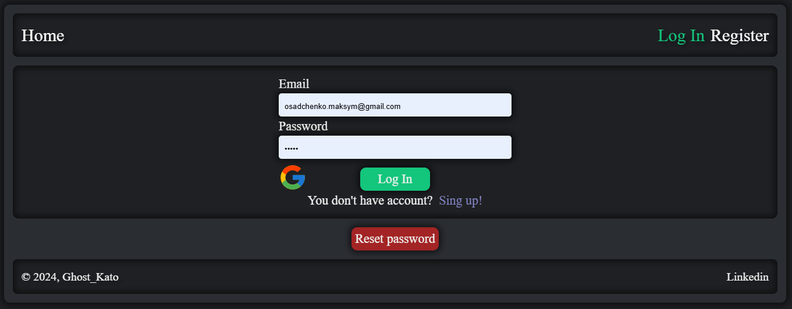

# Індивідуальний проект: App phonebook

### Опис:

Телефонна книга — це цифровий інструмент для зберігання контактної інформації, що дозволяє організовувати номери телефонів, електронні адреси та інші важливі дані про контакти. Цей проект має на меті створити зручний, інтуїтивно зрозумілий додаток для швидкого доступу до інформації про важливих осіб у вашому житті або бізнесі.

---

### Особливості:

1. **Інтерфейс:**

   - Простий і зручний дизайн.
   - Пошук за ім'ям.
   - Можливість додавати нові контакти з мінімальною кількістю кроків.
   - Відображення детальної інформації про кожен контакт (ім'я, номер телефону, email, фото).

   

2. **Категорії контактів:**

   - Можливість додавати контакти до списку улюблених, для швидкого доступу.

   

3. **Додавання фотографій:**

   - Кожен контакт можна супроводжувати фотографією, що полегшує пошук і впізнавання.

   

4. **Редагування та видалення:**

   - Легке редагування контактних даних або їх видалення при необхідності.

   

5. **Безпека:**

   - Захист персональних даних через шифрування та доступ до додатку за паролем.
   - Можливість зміни даних користувача через спеціальну форму, що дозволяє редагувати ім'я, email та фото.

   

6. **Адаптивний дизайн:**

   - Додаток оптимізовано для різних пристроїв, таких як смартфони, планшети та десктопи. Завдяки адаптивному дизайну користувачі можуть комфортно користуватися додатком на будь-якому екрані, зберігаючи зручність та функціональність.

7. **Авторизація через Google:**

   - Користувачі можуть увійти до додатку через Google, що полегшує процес авторизації та реєстрації. Це дозволяє зберегти час, оскільки не потрібно створювати новий обліковий запис вручну.

---

### Етапи реалізації:

1. **Дизайн інтерфейсу:**

   - Розробка макетів інтерфейсу, вибір кольорової гами та шрифтів, створення зручного меню та навігації.

   

2. **Розробка функціоналу:**

   - Реалізація основних функцій, таких як додавання, редагування та видалення контактів, пошук, а також здійснення дзвінків і відправка повідомлень на пошту.

   

3. **Тестування:**

   - Проведення тестів для забезпечення стабільної роботи додатку на різних пристроях.

   

4. **Запуск і підтримка:**

   - Публікація додатку та подальше оновлення для поліпшення функціональності на основі зворотного зв'язку користувачів.

   

---

### Переваги використання:

- Легкий доступ до інформації про важливих людей і компанії.
- Покращення організації особистих та робочих контактів.
- Збереження часу на пошук інформації.
- Можливість швидкого реагування завдяки зручному інтерфейсу.

---

### Використані технології:

1. **Мови програмування:**

   - **JavaScript**

2. **Фреймворки та бібліотеки:**
   - **React**
   - **React Router**
   - **Node.js**
   - **Redux**
3. **Бази даних:**

   - **MongoDB**

4. **Інтеграція з API:**

   - **SMTP**

5. **Безпека:**

   - **OAuth 2.0**
   - **JWT**
   - **HTTPS**
     **bcrypt**

6. **Інші технології:**

   - **Git**
   - **Cloudinary**

7. **Адаптивність:**

   - **CSS Media Queries**
   - **Flexbox**

---
